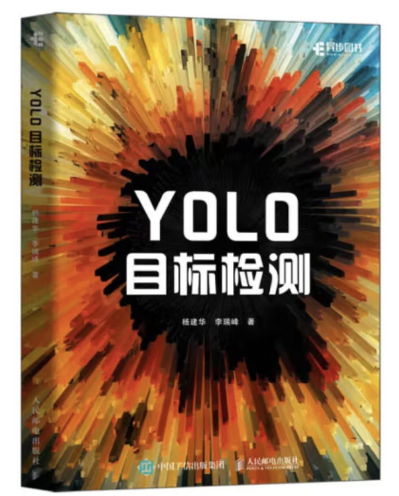

# 实时通用目标检测

我们在尝试基于YOLO的核心理念来构建我们的实时通用目标检测代码库。我们复现了绝大部分的YOLO系列。另外，我们还写了一本YOLO的入门教程，我们希望通过学习YOLO这一十分受欢迎的通用目标检测框架可以让初学者掌握研究通用目标检测所必须的基础知识。

如果你对我们出版的图书很感兴趣，可以在中国的淘宝和京东等电商平台去购买。



## 配置运行环境
- 首先，我们建议使用Anaconda来创建一个conda的虚拟环境
```Shell
conda create -n rtcdet python=3.6
```

- 然后, 请激活已创建的虚拟环境
```Shell
conda activate rtcdet
```

- 接着，配置环境:
1. 首先安装基础环境
```Shell
pip install -r requirements.txt 
```

2. (可选) 其次，可以考虑编译CUDA版本的 MSDeformableAttention 算子，以便使用DETR系列的检测器

```bash
cd ./ppdet/modeling/transformers/ext_op/

python setup_ms_deformable_attn_op.py install
```
See [details](./models/detectors/rtdetr/basic_modules/ext_op/)


项目作者所使用的环境配置:
- PyTorch = 1.9.1
- Torchvision = 0.10.1

为了能够正常运行该项目的代码，请确保您的torch版本为1.x系列。


## 实验结果
### VOC
- 下载 VOC.
```Shell
cd <PyTorch_YOLO_Tutorial>
cd dataset/scripts/
sh VOC2007.sh
sh VOC2012.sh
```

- 检查 VOC
```Shell
cd <PyTorch_YOLO_Tutorial>
python dataset/voc.py
```

- 使用 VOC 训练模型

例如:
```Shell
python train.py --cuda -d voc --root path/to/VOC -v yolov1 -bs 16 --max_epoch 150 --wp_epoch 1 --eval_epoch 10 --fp16 --ema --multi_scale
```

### COCO
- 下载 COCO.
```Shell
cd <PyTorch_YOLO_Tutorial>
cd dataset/scripts/
sh COCO2017.sh
```

- 清洗COCO
```Shell
cd <RT-ODLab>
cd tools/
python clean_coco.py --root path/to/coco --image_set val
python clean_coco.py --root path/to/coco --image_set train
```

- 检查 COCO
```Shell
cd <PyTorch_YOLO_Tutorial>
python dataset/coco.py
```

当COCO数据集的路径修改正确后，运行上述命令应该会看到COCO数据的可视化图像。

- 使用COCO训练模型

可以参考下方的命令：
```Shell
python train.py --cuda -d coco --root path/to/COCO -m yolov1 -bs 16 --max_epoch 150 --wp_epoch 1 --eval_epoch 10 --fp16 --ema --multi_scale
```

另外，我们也提供了脚本 `train.sh`，可以让使用者一键开启训练。为了顺利使用此文件，请遵循下方提供的命令实例来输入相关的参数：
```Shell
bash train.sh <model> <data> <data_path> <batch_size> <num_gpus> <master_port> <resume_weight>
```

例如，我们想使用该脚本来从头训练训练YOLOv3:
```Shell
bash train.sh yolov3 coco path/to/coco 128 4 1699 None
```

如果从已有的权重文件来继续训练模型（比如训练终端的情况），可以参考下方的运行命令：
```Shell
bash train.sh yolov3 coco path/to/coco 128 4 1699 path/to/yolov3.pth
```


## 测试
使用者可以参考下面的给出的例子在相应的数据集上去测试训练好的模型，正常情况下，使用者将会看到检测结果的可视化图像。

```Shell
python test.py -d coco \
               --cuda \
               -v yolov1 \
               --img_size 640 \
               --weight path/to/weight \
               --root path/to/dataset/ \
               --no_multi_labels \
               --visual_threshold 0.35 \
               --show
```


## 验证
使用者可以参考下面的给出的例子在相应的数据集上去验证训练好的模型，正常情况下，使用者将会看到COCO风格的AP结果输出。

```Shell
python eval.py -d coco \
               --cuda \
               -v yolov1 \
               --img_size 640 \
               --weight path/to/weight \
               --root path/to/dataset/ \
               --show
```

如果使用者想测试模型在COCO test-dev数据集上的AP指标，可以遵循以下步骤：

- 将上述命令中的`coco`修改为`coco-test`，然后运行；
- 运行结束后，将会得到一个名为`coco_test-dev.json`的文件；
- 将其压缩为一个`.zip`，按照COCO官方的要求修改压缩文件的名称，例如``;
- 按照COCO官方的要求，将该文件上传至官方的服务器去计算AP。

## Demo
本项目在`data/demo/images/`文件夹中提供了一些图片，使用者可以运行下面的命令来测试本地的图片：

```Shell
python demo.py --mode image \
               --path_to_img data/demo/images/ \
               --cuda \
               --img_size 640 \
               -m yolov2 \
               --weight path/to/weight \
               --show
```

如果使用者想在本地的视频上去做测试，那么你需要将上述命令中的`--mode image`修改为`--mode video`，并给`--path_to_vid`传入视频所在的文件路径，例如：

```Shell
python demo.py --mode video \
               --path_to_img data/demo/videos/your_video \
               --cuda \
               --img_size 640 \
               -m yolov2 \
               --weight path/to/weight \
               --show \
               --gif
```

如果使用者想用本地的摄像头（如笔记本的摄像头）去做测试，那么你需要将上述命令中的`--mode image`修改为`--mode camera`，例如：

```Shell
python demo.py --mode camera \
               --cuda \
               --img_size 640 \
               -m yolov2 \
               --weight path/to/weight \
               --show \
               --gif
```

### 检测的例子
* Detector: YOLOv2

运行命令如下：

```Shell
python demo.py --mode video \
                --path_to_vid ./dataset/demo/videos/000006.mp4 \
               --cuda \
               --img_size 640 \
               -m yolov2 \
               --weight path/to/weight \
               --show \
               --gif
```

结果如下：


## 目标跟踪
该项目也支持**多目标跟踪**任务。我们使用本项目的YOLO检测器作为“tracking-by-detection”的检测器，并使用简单高效的**ByteTrack**作为跟踪器。

* images tracking
```Shell
python track.py --mode image \
                --path_to_img path/to/images/ \
                --cuda \
                -size 640 \
                -dt yolov2 \
                -tk byte_tracker \
                --weight path/to/coco_pretrained/ \
                --show \
                --gif
```

* video tracking

```Shell
python track.py --mode video \
                --path_to_img path/to/video/ \
                --cuda \
                -size 640 \
                -dt yolov2 \
                -tk byte_tracker \
                --weight path/to/coco_pretrained/ \
                --show \
                --gif
```

* camera tracking

```Shell
python track.py --mode camera \
                --cuda \
                -size 640 \
                -dt yolov2 \
                -tk byte_tracker \
                --weight path/to/coco_pretrained/ \
                --show \
                --gif
```

### 多目标跟踪的例子
* Detector: YOLOv2
* Tracker: ByteTracker
* Device: i5-12500H CPU

运行命令如下：

```Shell
python track.py --mode video \
                --path_to_img ./dataset/demo/videos/000006.mp4 \
                -size 640 \
                -dt yolov2 \
                -tk byte_tracker \
                --weight path/to/coco_pretrained/ \
                --show \
                --gif
```

结果如下：


